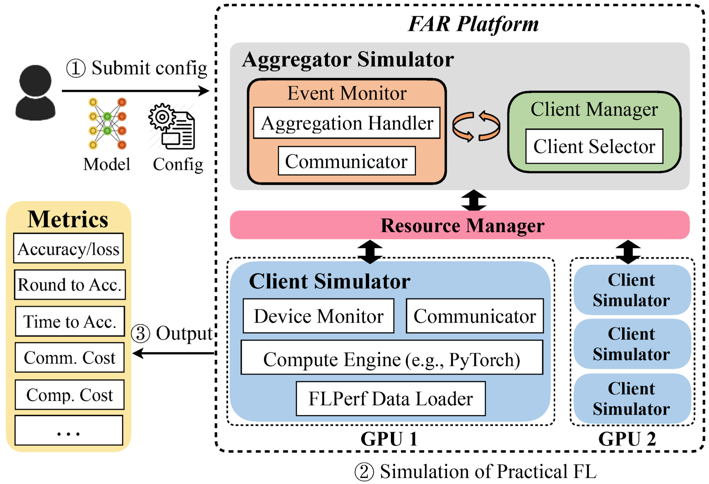

<div class="row">
  <div class="column">
    
  </div>
  <div class="column">
    
  </div>
</div>

## REFL: Resource-Efficient Federated Learning ([Paper](https://arxiv.org/abs/2111.01108))

This repository contains scripts and instructions of running REFL, a resource efficient federated learning framework. 
REFL systematically addresses the question of resource efficiency in FL, showing the benefits of intelligent participant selection, and incorporation of updates from straggling participants. 


REFL is an extension of [FedScale](http://fedscale.ai)  which provides a diverse set of datasets and benchmarks for FL training and evaluation. 
The datasets are large-scale, encompassing a diverse range of important FL tasks, such as image classification, object detection, language modeling, speech recognition, and reinforcement learning. 


***REFL will be open-sourced with permissive licenses and we welcome feedback and contributions from the community!***

## Overview

* [Getting Started](#getting-started)
* [Setting GPU Cluster](#setting-gpu-cluster)
* [Realistic FL Datasets](#realistic-fl-datasets)
* [Running REFL experiments](#running-refl-experiments)
* [Stopping the experiments](#stopping-the-experiments)
* [Repo Structure](#repo-structure)
* [Note](#acknowledgements)
* [Contact](#contact)

## Getting Started 

Our ```install.sh``` will install the following automatically:

* Anaconda Package Manager
* CUDA 10.2

Note: if you prefer different versions of conda and CUDA, please check  comments in `install.sh` for details.

Run the following commands to install the REFL conda environment. 

```
git clone https://github.com/ahmedcs/REFL
cd REFL
source install.sh 
```

Run the following commands to install Oort. 

```
cd REFL/thirdparty
python oort_setup.py install
```

### Setting GPU Cluster

***Please assure that these paths are consistent across all nodes so that the simulator can find the right path.***

- ***Master Node***: Make sure that the master node (parameter server) has access to other worker nodes via ```ssh```. 

- ***All Nodes***: Follow [this](#getting-started) to install all necessary libs, and then download the datasets by following [this](dataset/README.md).


## Realistic FL Datasets

***Below are the datasets used in the paper, you need to download the dataset before running the experiments ***

CV tasks:

| Dataset   | Data Type   | # of Clients | # of Samples | Example Task | 
|-----------| ----------- |--------------|--------------|    ----------- |
| CIFAR10   |   Image     | Custom       | 60K          |   Classification  |    
| OpenImage |   Image     | 13,771       | 1.3M         |   Classification, Object detection      |

NLP tasks:

| Dataset       | Data Type   |# of Clients  | # of Samples   | Example Task | 
| -----------   | ----------- | -----------  |  ----------- |   ----------- |
| Stackoverflow |   Text      |   342,477    |   135M        |  Word prediction, classification |
| Reddit        |   Text      |  1,660,820   |   351M        |  Word prediction   |
|Google Speech  |   Audio     |     2,618    |   105K        |   Speech recognition |


***Note that no details were kept of any of the participants age, gender, or location, and random ids were assigned to each individual. In using these datasets, we will strictly obey to their licenses, and these datasets provided in this repo should be used for research purpose only.***

Please go to `./dataset` directory and follow the dataset [README](dataset/README.md) for more details on how to setup these datasets.


## Running REFL experiments
REFL uses FedScale's Automated Runtime (FAR) which is an automated and easily-deployable evaluation platform, to simplify and standardize the FL experimental setup and model evaluation under a practical setting. FAR is based on [Oort project](https://github.com/SymbioticLab/Oort).



Please go to `./core` directory and follow the [README](core/README.md) file to understand more how the FL training scripts are invoked.

To run the experiments, we provide a customizable script that can automate launching many experiments at once. The script file in the main directory `run_exps.sh` can be adjusted as needed to set the various parameters which are documented in the script file.
The script takes as input, the dataset (or benchmark) to run and it will run all experiments and assigns to each server in a round robin fashion one experiment at a time until all experiments are launched at the same time. 
Ideally, we need to run a single experiment on each server, where 1 GPU is used as an aggregator and remaining ones are executors

The experimental results are collected and uploaded automatically via the WANDB visualization tool APIs called [WANDB](wandb.ai). **You should create/have an account on [WANDB](wandb.ai) and from the settings page get the API Key and username to set them in the experiment run scripts as shown next**

In [run_exps.sh](run_exps.sh) script, the IPS list refers to the list of server IPs and the GPUS list refers to number of GPUs per server. 
The remaining settings to be adjusted are well commented in the script file, they are:
```
#the path to the project
export MAIN_PATH=/home/user/REFL
# the path to the dataset, note $dataset, the dataset name passed as argument to script
export DATA_PATH=/home/user/REFL/dataset/data/$dataset
#the path to the conda envirnoment
export CONDA_ENV=/home/user/anaconda3/envs/refl
#the path to the conda source script
export CONDA_PATH=/home/user/anaconda3/

#Set WANDB for logging the experiments results or do wandb login from terminal
export WANDB_API_KEY=""
# The entity or team used for WANDB logging, should be set correctly, typically should be set your WANDB userID
export WANDB_ENTITY=""
```
These exported environments variables are passed to the experiments' [config files](core/evals/configs) as environment variables.

The following is an example of experiment invocation, by default we have 4 servers each equipped with 4 GPUs set in the `run_exps.sh` script.

```
conda activate refl
bash run_exps.sh google_speech
```
Additionally we give a customized version of the [run_exps.sh](run_exps.sh) script, which are [run_E1.sh](run_E1.sh) and [run_E2.sh](run_E2.sh) to run experiments comparing REFL vs Oort (the results of Figure 9.b in the paper) and REFL vs SAFA (the results in Figure 10.b in the paper), respectively.  
Now, to run the experiment E1, just invoke the following line in the main directory. Ensure to login to WANDB or set the WANDB_API_KEY in the script file.
```
conda activate refl
bash run_E1.sh google_speech
```
**Note each experiment is launched with its own timestamp and all logs and intermediate models are stored in a folder named after the timestamp**

## Plotting the experiments
To plot the results, we provide a customizable script that can automate plotting the results by invoking WANDB APIs to get the data and use Matplotlib for actual plotting. 
The script is located in the plots directory and named [plot_exp.py](plots/plot_exp.py) which helps with plotting the results.
We also give all the commands used for plotting all the figures in the paper as detailed in [plot_cmds](plots/plot_cmds.md), for example to plot the results from experiments of [run_E1](run_E1.sh), invoke the following command:
```
python plots/plot_exp.py 'exp_type' google_speech_resnet34 'oort' 'Test' 1 10
```

## Stopping the experiments
To stop the experiments before they complete, we provide a customizable script that can automate killing certain experiments of particular benchmark or all the benchmarks. The script takes as input the dataset name (or benchmark) and the auto generated timestamp based on current date and time.
To kill the currently running google_speech experiments with a timestamp 220722_12737
```
bash kill_exps.sh google_speech 220722_12737
```
To kill all the currently running google_speech experiments 
```
bash kill_exps.sh google_speech
```
To kill all currently running experiments
```
bash kill_exps.sh all
```

## Repo Structure

```
Repo Root
|---- dataset     # Realistic datasets in REFL
|---- plots      # scripts and commands for plotting the results
|---- core        # Experiment platform of REFL containing aggregator, clients, executors and resource manager
    |---- utils   # Utiliy and helper modules such as dataloaders, decoder, data divider, models, etc
    |---- evals     # Backend of job submission
 
```

## Notes
please consider to cite our papers if you use the code or data in your research project.

```bibtex
@inproceedings{REFL-arxiv,
  title={Resource-Efficient Federated Learning},
  author={Ahmed M. Abdelmoniem, Atal Narayan Sahu, Marco Canini, Suhaib A. Fahmy},
  booktitle={arXiv:2111.01108},
  year={2021}
}
```

and  

```bibtex
@inproceedings{REFL-EuroSys23,
  title={REFL: Resource Efficient Federated Learning},
  author={Ahmed M. Abdelmoniem, Atal Narayan Sahu, Marco Canini, Suhaib A. Fahmy},
  booktitle={ACM EuroSys},
  year={2023}
}
```

## Contact
Ahmed M. A. Sayed, aka. Ahmed M. Abdelmoniem (ahmedcs982@gmail.com).


